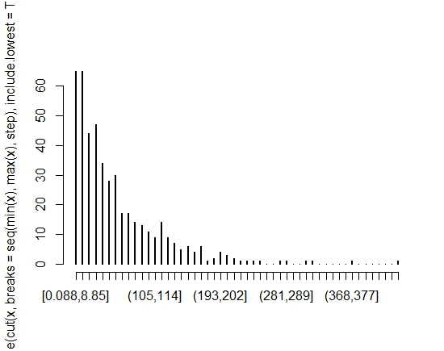
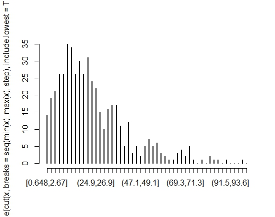
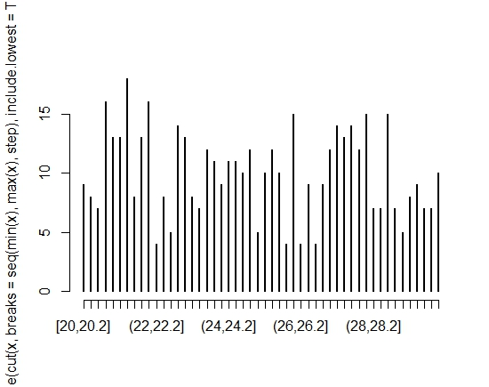

#Injection molding
Exponential distribution, lambda = 58.26

#Dye coating
Gamma distribution, scale = 9, shape = 3. The histogram for the second machine group indicated a gamma distribution. We tried to find parameters using a Q-Q-plot and a trial-and-error approach. With values 9 for scale and 3 for shape, we estimated that we had a decent fit.

#Printing and finishing
The last production step had processing times that seemed uniformly distributed. The average value was 24.8.
