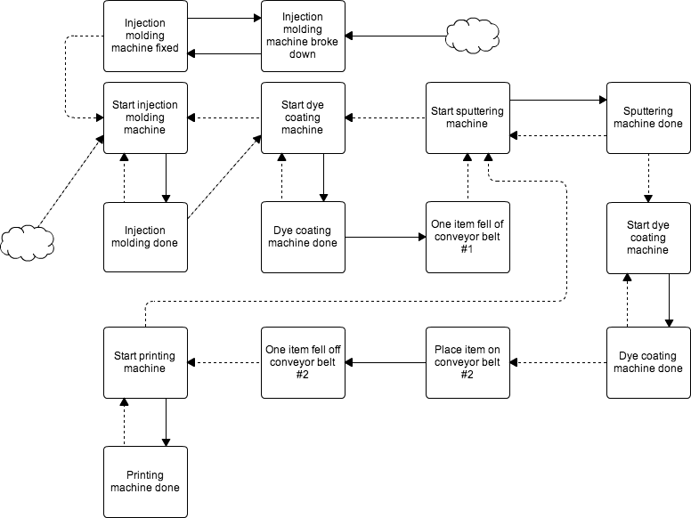
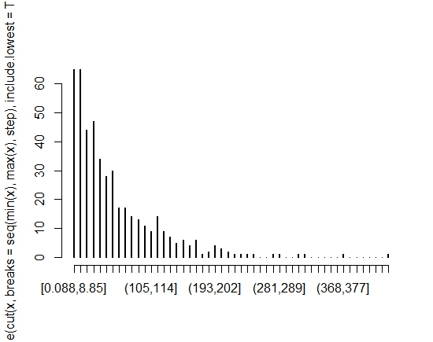
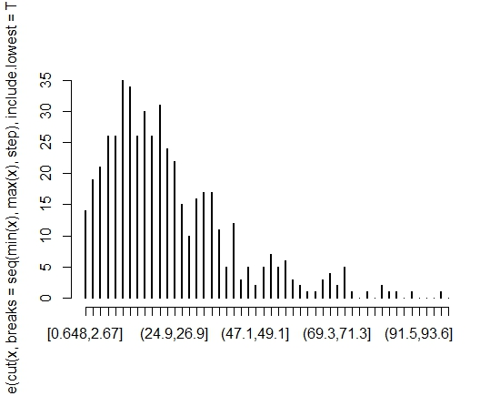
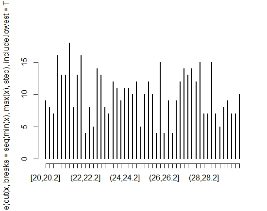
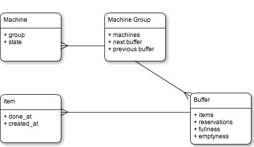
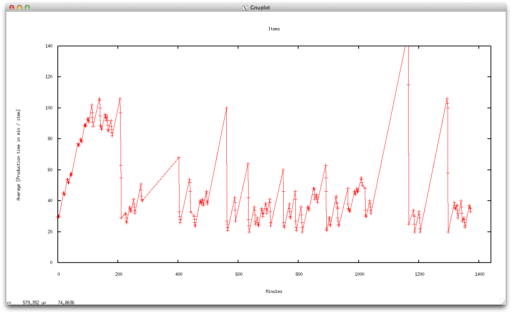
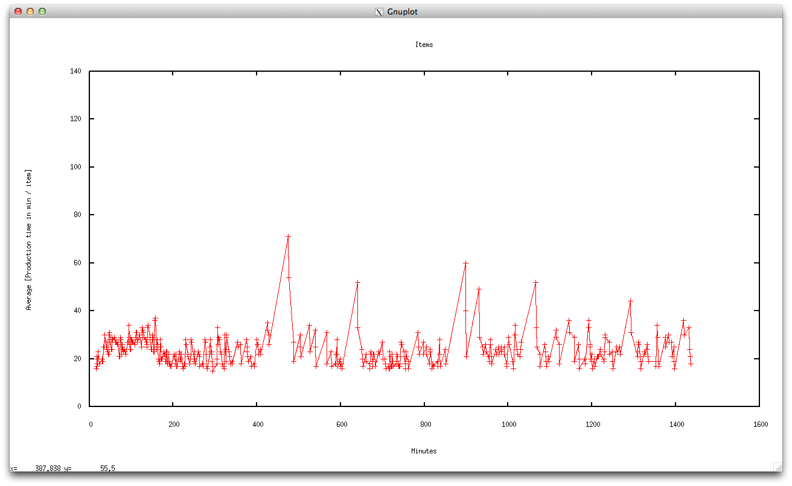
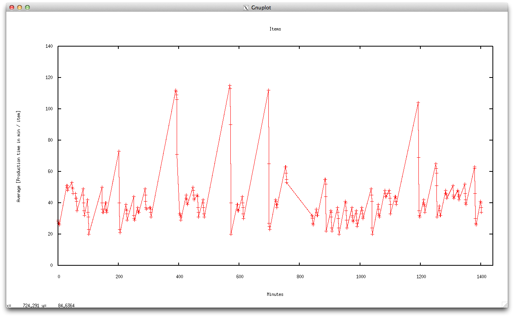
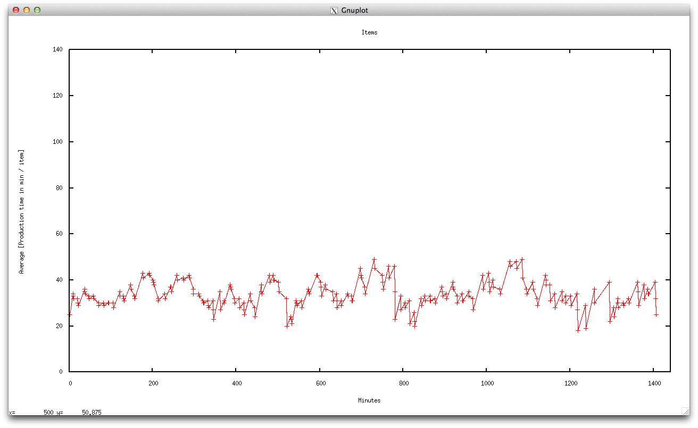

## Report

### Implementation

#### Machine Groups
#### Machine
#### Buffer
#### Item

### Explain

- Definera bästa utfall

### Assumptions

We're made a few assumptions regardning the third machine. We've tried to make logical assumptions based on the information we got from the interview.

#### Sputtering

This part of the machine can handle one batch à 20 items at the time. As soon as all items in one batch has been processed (20 * 10 seconds) the batch is passed to the lacquer coating machine. The coating machine can't crash nor stall, it's also faster than sputtering. This means that that the sputtering machine doesn't have to wait for the lacquer coating machine to be done.

Items in the sputtering machine can get stuck. Everytime an item is stuck, the machine stalls. This means that a batch as a whole will be delayed for further processing. In our simulation the amount of items that is going to get stuck is calculated *before* the event is scheduled. Each stuck item delayes the machine with 5 minutes. 

Read more about the distribution used in the *Distributions* sections below.

#### Lacquer coating

This part does the same thing as the sputtering. It process 20 items in sequence each taking 6 seconds. As soon as all items are done the batch as whole is placed on the conveyor belt.

## Problem description

A DVD factory wants to optimize there production by keeping the ratio between system throughput, buffer size and the amount of machines has low as possible.

### Analysis of the problem

### How it's made

#### Step 1 – Performance measurements [TODO: fixa def. av throughput och production/hour!!]

Three key aspects was analysed; throughput time, production time and miss rate on buffers. Throughput time being the amount if items produced per time unit, production time the total time for an item to be produced and miss rate on buffers the total amount of times a buffer could not receive new items or could not deliver new items to surounding machines.

We want to keep the the production time and buffer misses low and throughput time as high as possible.

#### Step 2 – States

- Buffer
  - Current items
  - Reserved items
  - Amount of misses related to 'fullness'
  - Amount of misses related to 'emptiness'
- Machine
  - State (idle, break, start)
- Item
  - done_at
  - created_at

#### Step 3 – Event graph and handlers

- #1 (Start injection molding)
  - Tries to start injection molding machine
  - Schedules
    - if start was a success
      - Event handler #2
  - Changes
    - if start was a success
      - Reserves one item in buffer #1
      - Mark one machine in machine group #1 as started
      - Create item with initial time (time the item was created)
- #2 (injection molding done)
  - Injection molding is done
  - Schedules
    - Unless machine group #1 was or is broken
      - Restart/start machine group #1
      - Try to start machine group #2
  - Changes
    - Unless machine group #1 was or is broken
      - Mark machine as idle
      - Add item to buffer #1
- #3 (Start dye coating machine group)
  - Tries to start injection molding machine
  - Schedules
    - if start was a success
      - Event handler #4
  - Changes
    - If avalible machines > 0, previous buffer isn't empty and next buffer isn't full
      - Decrement previous buffer with one
      - Reserve one item in buffer #2
      - Mark one machine in group as taken
- #4 (Dye coating machine group done)
  - Dye coating machine group is done
  - Schedules
    - Restart/start machine group #2
    - Event handler #5, one new item on conveyor belt
  - Changes
    - Mark machine as idle
- #5 (Conveyor belt)
  - One item just fell of the conveyor belt
  - Schedules
    - Event handler #6, start sputtering machine group
  - Changes
    - Increment next buffer by one
    - Remove reservation on next buffer
- #6 (Try to start sputtering machine group)
  - Try to start sputtering machine group
  - Schedules
    - If buffer #2 % 20 == 0 and avalible machines > 0
      - Event handler #7, sputtering machine done
        - Take into acount that an
      - Event handler #3, try to start dye coating machine group
  - Changes
    - If buffer #2 % 20 == 0 and avalible machines > 0
      - Decrement buffer #2 by 20
      - Reserve 20 items in buffer #2
      - Mark one machine in machine group as started
- #7 (Sputtering machine done)
  - A sputtering machine is done
  - Schedules
    - Event handler #6, try to restart sputtering machine group
    - Event handler #8, start coating machine group
  - Changes
    - Mark done machine as idle
- #8 (Start coating machine group)
  - Start a coating machine. This machine will always be avalible and ready after the sputtering machine group is done
  - Schedules
    - Event handler #9, coating machine done
  - Changes
    - Nothing
- #9 (Coating machine done)
  - Coating machine is done
  - Schedules
    - Event handler #10, start conveyor belt #2
  - Changes
    - Nothing
- #10 (Start conveyor belt #2)
  - Conveyor belt #2 has started
  - Schedules
    - Event handler #11, one item just fell of conveyor belt #2
  - Changes
    - Nothing
- #11 (20 items just fell of conveyor belt #2)
  - 20 items just fell of conveyor belt #2
  - Schedules
    - 20 x event #12, try to start printing machine group
  - Changes
    - Increment buffer #3 by 20
    - Remove reservation (20 items) from buffer #2
- #12 (Trying to start printing machine group)
  - Trying to start printing machine group
  - Schedules
    - If avalible machines > 0 and buffer #3 isn't empty
      - Event #13, printing machine is done
      - Event #6, try to start sputtering machine
  - Changes
    - If avalible machines > 0 and buffer #3 isn't empty
      - Decrement buffer #3 by 1
      - Mark one machine in machine group as started
- #13 (Printing machine done)
  - Printing machine is done
  - Schedules
    - Event #12, try to restart printing machine group
  - Changes
    - Write end time to produced item
    - Add item to buffer #4 (output container)
    - Mark machine done as idle
- #14 (Injection molding machine just broke down)
  - Injection molding machine just broke down
  - Schedules
    - Event handle #15, machine was fixed
  - Changes
    - Mark machine as broken
- #15 (Injection molding machine is now fixed)
  - Injection molding machine is now fixed
  - Schedules
    - Event handle #1, try to start/restart injection molding machine
    - Event handle #14, injection molding machine just broke down
  - Changes
    - Mark machine as fixed. This will put the fixed machine in the idle state

#### Step 4 – Distributions

##### Injection molding

Exponential distribution, lambda = 58.26

##### Dye coating

Gamma distribution, scale = 9, shape = 3. The histogram for the second machine group indicated a gamma distribution. We tried to find parameters using a Q-Q-plot and a trial-and-error approach. With values 9 for scale and 3 for shape, we estimated that we had a decent fit.

#### Step 5 – Implementation

All logic related to a machine is encapsulated in its own event handler. This means that this event might be called even tho the machine group it self isn't ready. So for example if machine #2 has started and therefor decresed buffer #1 by one (the buffer used by machine #1 and machine #2) it will, without checking the state of machine group #2, try to start #1 by calling event handler #1. This structure means that we can keep all logic for one machine group contained within one event handler.

We've tried to do as few things as possible in one event handler, even if the outcome in some cases is an event handler that only acts as a proxy. One example is event handler #5. It only acts as a implementation proxy with the single purpose of reporting its current state and call event handler #6. An alternitive would be to call event handler #6 directly from #4. The drawback would be a bit more complicated event graph, which wouldn't benefit anyone.

##### Details

The implementation is done in the programming language Ruby. It's now super fast, which is shown in the benchmark tests, but it's highly effecent when doing prototyping.

We went with a object oriented design, which encapsulates all logic into classes. This made a huge diffrentce when it came to implementing the event handlers. I most cases the amount of code in the psudo example above and the real implementation is almost a one to one mapping.

###### Initialization

The first thing that happens on start up, right after all classes has been initialized, is scheduling of breakdowns and startup sequence for machine one. Note that there isn't any inital time set for start of machine one, it's scheduled to started right a way. The breakdown sequence on the other hand has an initial time specified by the distribution below.

###### Classes

####### MachineGroup

This class represents a group of machines of a certain kind, for example a printing machine. As soon as a machine within a specific group wants to be started the machine group is asked. It will try to start a machine given that the following conditions are satisfied:

- Is there enough room in the next and previous buffer?
- Do we have any machines avalible?

####### Machine

Represents one single machine with in a group. A machine move between three different states.

- Idle - The machine is avalible and can be started at any time
- Started - The macine is currently busy and can therefore not be started
- Broken - The machine is currently broken and can therefore not be started

####### Buffer

Keeps track on all items. There are two diffrent buffers, one normal that has a maximum size and one sizeless buffer that acts as output for the system. The endless buffer is connected to machine 4.

A buffer knows how many time a machine has *tried* to interact with it using the below params.

- Fullness - The amount of times a machine wanted to reserve items but could due to fullness.
- emptiness - The amount of times a machine wanted to take items but could due to emptiness.

These two parameters are important in trying to find the bottleneck in our system. A high *emptiness* value in a buffer means that we should increase the buffer size or the amount of machines in previous steps. A high *fullness* value in a buffer means that there is a bottleneck to the right. Increasing buffer or/and the amount of machines might solve the problem.

####### Item

Encapsulates the time from which the item was created and added to the *output buffer*.

###### Reservations

Imagine this problem

1. [0:00] Buffer #1 is almost full, it can only take one more item
2. [0:00] Machine #1 that uses buffer #1 check to see if buffer is full. It's not so it starts and schedules to be done in 15 min.
3. [0:05] Machine #2 that also uses buffer #1, it check buffer #1 and draws the same conclusions. It starts it self and schedules to be done in 2 min.
4. [0:07] Machine #2 is now done, it adds one item to buffer #1, which is now full.
5. [0:15] Machine #1 is now done, but buffer #1 is full so everyting was in vain.

What we could do here in instead is to *reserve* one item in step #2 and unreserve one item in step #5. The outcome would be that machine #2 never starts.

This is solution we've used in our implementation.

This is how it would look from machine #1 point of view *when is comes to dealing with buffers*.

- On start
  - Start if previous buffer count > 0 and if next buffer is not full, including reserved items
  - Reserve one item in next buffer
  - Decrease previous buffer by one
- When done
  - Unreserve 1 item in next buffer
  - Add one item to next buffer

#### Step 6 - Simulation

To ensure the best outcome we started by defining the upper and lower limits for the system. The current configuration is as follows.

- Buffer capacities
  - #1 as a max capacity of 20
  - #2 as a max capacity of 20, by can only handle ha mutiple of 20
  - #3 as a max capacity of 20
- Amount of machines
  - Injection molding: 4
  - Dye coating: 2
  - Sputtering: 2
  - Lacquer coating: 2
  - Printing: 2

We call this set up the base line, we won't go below any of the above numbers. 

The upper limits was a bit more tricky. Increasing the base line to infinity capacity wouldn't make any sense, nor would it be realistic. According to the interview a realistic upper limits for the buffers would be 100, 100 and 100, but nothing were specified for the machines.

To get a proper sample size one could either run multiply times for a short perioid of time or run the simlulation a bit longer but only once. We went with running the simulation for a longer period, in our case 3 days. According to our tests one simulation simulating 3 days took approximately 90 seconds using the base line.

Increasing each buffer by 40 up to a hundred for each buffer would take 27 itterations, which would take 40 minutes to run.

In each iiteration the following data where calculated and collected.

- thruput
- production
- variance thruput
- variance production
- buffer misses

Everyting were then but into a table and sorted by ascending thruput and descending production. The top 10 results can be found in an apendix (TODO: add apendix).

#### Step 7 – Analysis

##### Warm up period to steady state

To ensure that the output data used in our calculations doesn't fluxuated, which is usualy the case in the begining of a simulation, we graphically tried to determine where and when the system became stable.

Complex systems often go through a warm up period before they reach a steady state or some sort of cyclic fluctuations. To make sure that this warm up period did not influence our output values, we ran the simulations with both maximal and minimal parameter values and graphically determined a point in time where all the systems had completed their initial warm up. This time plus a margin of XXX was used as the starting point for our measurements.

A parameter that nicely represents the current state of the system is the average production time of an item [min / item].

We did not have the CPU power to look all samples to find the warm up period, instead we used the edge cases. 

Note: The x-axis represents the elapsed time in minutes and the y-axis the average time in minutes for an item to pass through the system.

- Max buffers, minimum amount of machines

- Max buffers, maximum amount of machines

- Min buffers, minimum amount of machines

- Min buffers, maximum amount of machines

It looks like image #1 and #2 has the highest warm up period of 200 minutes. Adding an extra 50 minutes as a margin would keep us out of the warm up range.

##### Output

###### Run 1

Attatchments #1 is the result of one simulation for 4 days using 27 diffrent buffer sizes. The output is sorted by descending production time. 

According test 3 (counted from above) the last buffer has an fullness rate of ~ 46% when set to size 20. Increasing the buffer size to 60 (according to #1 and #2) would lower the rate to about 8%. It looks in other words like we could increase the the last buffer to size 40.

The diffrence in production rate between #1 and #2 are quite small, but the buffer sizes differs at bit. Going with the smallest buffer size combined with our ajustment to buffer #3 would be our new parameters for the next simulation.

A note: Buffer #2 for the top 3 results has a very high *emptiness* rate. This is probably caused by previous machines being to slow or the buffer being to big. A soluton would be to scale up machine #1 and #2. Scaling the machines is quite expencive, so we will try to avoid doing so. Another, cheaper soluton would be to decrease buffer #2.

Configurations for the next simulation.

- Buffer #1: 20
- Buffer #2: 40
- Buffer #3: 40

###### Run 2

Attachment #2.

As noted above buffer #2 is mostly empty (65% of the time) even during this run. Increasing the amount of machines before buffer #2 might solve the problem. Let's try it!

###### Run 3

## Attatchments

### Output

Buffers are being printed according to the following format.

`[fullness in percent] | [emptiness in percent] | [amount of items] | [size] ?? [.. buffer 2 ..] ?? [.. buffer 3..]`

#### 1. Sorted by descending production

    +-----------------------------------------------------------+---------+------------+---------------------+------------------+
    | buffers                                                   | thruput | production | variance_production | variance_thruput |
    +-----------------------------------------------------------+---------+------------+---------------------+------------------+
    | 0.018|0.078|0|60 ?? 0.0|0.654|6|60 ?? 0.0|0.084|0|60      | 0.64    | 55.54      | 1.59                | 0.39             |
    | 0.05|0.092|2|20 ?? 0.0|0.654|17|60 ?? 0.0|0.084|0|60      | 0.61    | 52.7       | 1.47                | 0.37             |
    | 0.026|0.074|0|100 ?? 0.0|0.341|13|100 ?? 0.456|0.047|0|20 | 0.98    | 52.27      | 4.72                | 0.69             |
    | 0.029|0.08|0|60 ?? 0.0|0.655|6|100 ?? 0.0|0.085|0|60      | 0.69    | 52.27      | 1.9                 | 0.43             |
    | 0.031|0.005|51|100 ?? 0.109|0.584|7|20 ?? 0.0|0.087|3|60  | 1.43    | 52.0       | 9.47                | 0.74             |
    | 0.023|0.08|9|100 ?? 0.003|0.37|9|60 ?? 0.43|0.05|0|20     | 0.81    | 51.87      | 3.08                | 0.58             |
    | 0.012|0.086|0|60 ?? 0.0|0.36|18|100 ?? 0.44|0.049|15|20   | 0.8     | 51.43      | 2.91                | 0.56             |
    | 0.004|0.078|0|100 ?? 0.0|0.654|17|100 ?? 0.0|0.082|0|100  | 0.69    | 49.44      | 1.99                | 0.45             |
    | 0.018|0.085|0|100 ?? 0.0|0.655|12|60 ?? 0.0|0.085|0|100   | 0.7     | 48.78      | 2.09                | 0.44             |
    | 0.014|0.018|0|100 ?? 0.111|0.57|6|20 ?? 0.038|0.084|0|20  | 1.26    | 48.13      | 7.75                | 0.76             |
    | 0.032|0.097|6|20 ?? 0.0|0.429|16|100 ?? 0.376|0.054|6|20  | 0.68    | 48.04      | 1.99                | 0.47             |
    | 0.012|0.09|16|60 ?? 0.002|0.399|25|60 ?? 0.404|0.052|0|20 | 0.74    | 47.91      | 2.34                | 0.48             |
    | 0.014|0.077|8|100 ?? 0.0|0.654|6|60 ?? 0.0|0.083|0|60     | 0.72    | 47.91      | 2.24                | 0.47             |
    | 0.011|0.075|0|60 ?? 0.0|0.655|16|100 ?? 0.0|0.083|0|100   | 0.67    | 46.63      | 1.84                | 0.43             |
    | 0.022|0.024|18|60 ?? 0.108|0.585|13|20 ?? 0.0|0.086|0|60  | 0.88    | 46.61      | 3.32                | 0.53             |
    | 0.031|0.017|0|60 ?? 0.103|0.572|6|20 ?? 0.046|0.083|0|20  | 0.96    | 46.39      | 4.02                | 0.57             |
    | 0.018|0.086|15|60 ?? 0.0|0.654|0|60 ?? 0.0|0.085|0|100    | 0.66    | 45.74      | 1.73                | 0.4              |
    | 0.06|0.087|0|20 ?? 0.0|0.655|8|60 ?? 0.0|0.085|0|100      | 0.63    | 45.52      | 1.62                | 0.4              |
    | 0.078|0.03|0|20 ?? 0.097|0.592|13|20 ?? 0.0|0.087|0|100   | 0.68    | 45.3       | 1.8                 | 0.45             |
    | 0.049|0.096|7|20 ?? 0.0|0.653|13|100 ?? 0.0|0.084|0|100   | 0.64    | 44.65      | 1.71                | 0.4              |
    | 0.041|0.094|16|20 ?? 0.0|0.493|5|60 ?? 0.301|0.061|0|20   | 0.68    | 44.65      | 1.88                | 0.45             |
    | 0.002|0.105|0|100 ?? 0.0|0.654|10|100 ?? 0.0|0.085|4|60   | 0.64    | 44.36      | 1.78                | 0.44             |
    | 0.044|0.094|1|20 ?? 0.0|0.654|4|100 ?? 0.0|0.085|0|60     | 0.64    | 43.99      | 1.75                | 0.42             |
    | 0.075|0.034|6|20 ?? 0.096|0.566|6|20 ?? 0.072|0.08|6|20   | 0.7     | 43.81      | 1.93                | 0.48             |
    | 0.03|0.027|16|100 ?? 0.104|0.587|0|20 ?? 0.0|0.087|0|100  | 1.17    | 43.75      | 6.86                | 0.82             |
    | 0.068|0.033|17|20 ?? 0.094|0.593|16|20 ?? 0.0|0.087|0|60  | 0.69    | 40.6       | 1.98                | 0.48             |
    | 0.032|0.03|47|60 ?? 0.101|0.588|0|20 ?? 0.0|0.087|0|100   | 0.92    | 40.07      | 3.73                | 0.54             |
    +-----------------------------------------------------------+---------+------------+---------------------+------------------+

#### 2. Run 2

    +-------------------------------------------------------+---------+------------+---------------------+------------------+
    | buffers                                               | thruput | production | variance_production | variance_thruput |
    +-------------------------------------------------------+---------+------------+---------------------+------------------+
    | 0.059|0.09|0|20 ?? 0.0|0.654|7|40 ?? 0.001|0.086|0|40 | 0.65    | 42.03      | 2.0                 | 0.46             |
    +-------------------------------------------------------+---------+------------+---------------------+------------------+

#### 3. Run 3

    +------------------------------------------------------------+---------+------------+---------------------+------------------+
    | buffers                                                    | thruput | production | variance_production | variance_thruput |
    +------------------------------------------------------------+---------+------------+---------------------+------------------+
    | 0.027|0.222|0|20 ?? 0.055|0.291|11|60 ?? 0.469|0.038|10|40 | 0.54    | 117.73     | 1.0                 | 0.29             |
    +------------------------------------------------------------+---------+------------+---------------------+------------------+