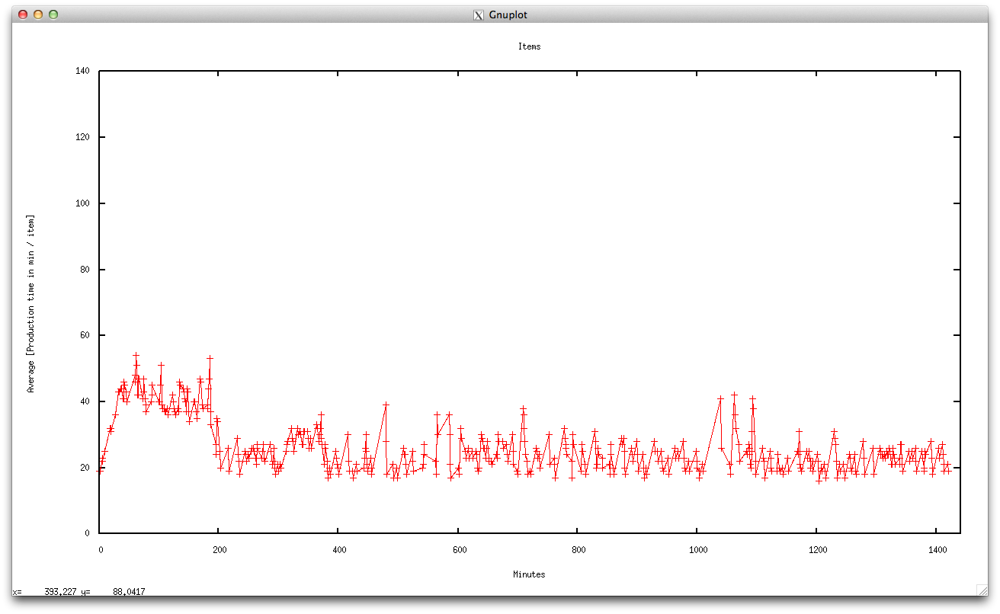
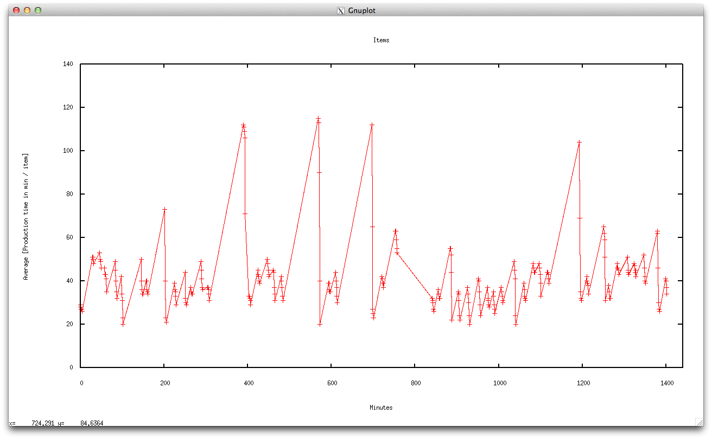

# 1

Max buffers, minimum amount of machines

`ruby simulation.rb --runtime 200 --quiet 1 --buffers 100,100,100 --im 4 --dye 2 --sputt 2 --lac 2 --print 2`

# 2

Max buffers, maximum amount of machines

`ruby simulation.rb --runtime 200 --quiet 1 --buffers 100,100,100 --im 12 --dye 6 --sputt 6 --lac 6 --print 6`

# 3

Min buffers, minimum amount of machines

`ruby simulation.rb --runtime 200 --quiet 1 --buffers 20,20,20 --im 4 --dye 2 --sputt 2 --lac 2 --print 2`

# 4

Min buffers, maximum amount of machines

`ruby simulation.rb --runtime 200 --quiet 1 --buffers 20,20,20 --im 12 --dye 6 --sputt 6 --lac 6 --print 6`

